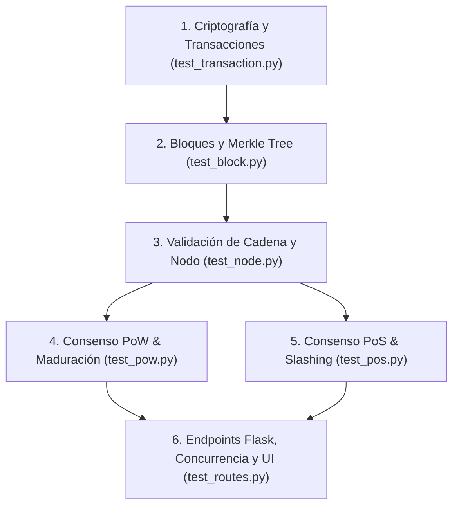

# Plan de Pruebas Unitarias e Integración — Sección 5 (Guía del Simulador Blockchain)

Este documento especifica la suite de pruebas automatizadas para la plataforma blockchain didáctica (PoW y PoS), cumpliendo estrictamente con la **Sección 5 de la Guía del Simulador Blockchain** y las invariantes congeladas en `AGENTS.md`.

---

## 1. Fixtures Compartidos (`tests/conftest.py`)

A continuación se definen los fixtures reutilizables en pytest para inicializar componentes criptográficos, nodos, cadenas de bloques y estados de la aplicación.

### `fresh_wallet`
- **Firma**: `() -> Wallet`
- **Retorno**: Instancia limpia de `Wallet` con un par de llaves Ed25519 recién generadas.

### `funded_wallet`
- **Firma**: `(wallet: Wallet, balance: float = 100.0) -> tuple[Wallet, float]`
- **Retorno**: Tupla con la `Wallet` y un saldo asignado en la simulación/estado contable.

### `valid_transaction`
- **Firma**: `(sender_wallet: Wallet, receiver_address: str, amount: float = 10.0, data: dict = None) -> Transaction`
- **Retorno**: Instancia de `Transaction` con `data` obligatoriamente como `dict`, `tx_id` computado determinísticamente y `signature` válida Ed25519.

### `fresh_network`
- **Firma**: `(num_nodes: int = 4, difficulty: int = 4) -> Network`
- **Retorno**: Instancia de `Network` en memoria configurada con `num_nodes` nodos (`"A"`, `"B"`, `"C"`, `"D"`), cada uno provisto de su motor `ProofOfWork(difficulty=difficulty)`.

### `chain_with_n_blocks`
- **Firma**: `(node: Node, n: int = 3) -> Node`
- **Retorno**: El `Node` cuya cadena contiene el bloque Génesis más `n` bloques minados válidamente con transacciones simuladas.

### `pos_validators_set`
- **Firma**: `(staked_amounts: dict[str, float]) -> list[dict]`
- **Retorno**: Lista de validadores PoS configurados con sus respectivas apuestas (stakes) e identidades.

### `flask_client`
- **Firma**: `() -> FlaskClient`
- **Retorno**: Cliente de pruebas HTTP de Flask (`app.test_client()`) configurado con la app instanciada mediante `create_app()`.

---

## 2. Especificación de Casos de Prueba de la Sección 5

---

### Categoría 1: Transacciones (y Validación de Entradas)

#### Case TX-01: Parámetros de Entradas Inválidos (N fuera de rango, Dificultad, Montos, Nodos)
- **Categoría**: Transacciones
- **Caso PDF**: $N$ fuera de 10–20; montos negativos, cero, no numéricos o vacíos; emisor igual a receptor; nodos inexistentes; dificultad fuera de rango.
- **Entradas**:
  - `num_nodes`: 5 o 25 (fuera de [10, 20]).
  - `amount`: `-50.0`, `0.0`, `"abc"`, `""`, `None`.
  - `sender` == `receiver`.
  - `node_id`: `"Nodo_Fantasma"`.
  - `difficulty`: `0` o `99`.
- **Archivo de destino**: `tests/test_transaction.py` / `tests/test_routes.py`
- **Función**: `test_invalid_transaction_inputs()`
- **Fixtures**: `flask_client`, `funded_wallet`
- **Aseveraciones**:
  - `response.status_code == 400`
  - Ninguna transacción corrupta ingresa a la mempool del nodo.
  - La cadena no altera su altura ni sus hashes.
- **Mensaje de UI / Error esperado**: Retorna HTTP 400 con JSON/Mensaje flash claro: `"Parámetros de entrada inválidos: verifique montos positivos, nodos existentes y rango de parámetros."` (Sin error 500).

#### Case TX-02: Transacción con Firma Alterada
- **Categoría**: Transacciones
- **Caso PDF**: Firma alterada.
- **Entradas**: `tx` válida creada y firmada por `Alice`, modificando su `signature` invirtiendo el último byte hex.
- **Archivo de destino**: `tests/test_transaction.py`
- **Función**: `test_altered_signature_rejection()`
- **Fixtures**: `fresh_wallet`
- **Aseveraciones**:
  - `tx.verify() == False`
  - `node.submit_transaction(tx) == False`
  - La transacción no se agrega a la mempool.
- **Mensaje de UI / Error esperado**: `"Firma digital inválida o alterada."`

#### Case TX-03: Transacción Firmada por Otra Clave (Suplantación)
- **Categoría**: Transacciones
- **Caso PDF**: Transacción firmada por otra clave.
- **Entradas**: `tx` con `sender = Alice.direccion()`, pero firmada usando `Bob._private_key`.
- **Archivo de destino**: `tests/test_transaction.py`
- **Función**: `test_wrong_key_signature_rejection()`
- **Fixtures**: `fresh_wallet` (Alice y Bob)
- **Aseveraciones**:
  - `tx.verify() == False`
  - `verificar_firma(tx.to_dict(), tx.signature) == False`
- **Mensaje de UI / Error esperado**: `"La firma no corresponde al emisor declarado."`

#### Case TX-04: Saldo Insuficiente
- **Categoría**: Transacciones
- **Caso PDF**: Saldo insuficiente.
- **Entradas**: Wallet con saldo contable de $10.0$ intenta enviar una `tx` con `amount = 50.0`.
- **Archivo de destino**: `tests/test_transaction.py`
- **Función**: `test_insufficient_balance_rejection()`
- **Fixtures**: `funded_wallet`
- **Aseveraciones**:
  - La transacción es rechazada en la capa de negocio (`viola_regla` o control de saldo).
  - La mempool rechaza la transacción.
- **Mensaje de UI / Error esperado**: `"Saldo insuficiente para realizar la transacción."`

#### Case TX-05: Doble Gasto en el Mismo Bloque
- **Categoría**: Transacciones
- **Caso PDF**: Doble gasto en el mismo bloque.
- **Entradas**: Dos transacciones `tx1` y `tx2` firmadas por `Alice` gastando el mismo saldo total (ej. saldo $50$, `tx1` gasta $40$, `tx2` gasta $40$) enviadas a la mempool para incluirse en el mismo bloque.
- **Archivo de destino**: `tests/test_transaction.py`
- **Función**: `test_double_spending_same_block()`
- **Fixtures**: `funded_wallet`, `fresh_network`
- **Aseveraciones**:
  - La primera `tx1` es aceptada en la mempool.
  - La segunda `tx2` es rechazada por colisión de UTXO/saldo insuficiente.
  - Solo una transacción es incluida en el bloque preparado.
- **Mensaje de UI / Error esperado**: `"Doble gasto detectado: transacción en conflicto rechazada."`

#### Case TX-06: Doble Gasto en Bloques Distintos
- **Categoría**: Transacciones
- **Caso PDF**: Doble gasto en bloques distintos.
- **Entradas**: `tx1` agregada y minada en el Bloque $N$. `tx2` con los mismos fondos intenta agregarse a la mempool para el Bloque $N+1$.
- **Archivo de destino**: `tests/test_transaction.py`
- **Función**: `test_double_spending_different_blocks()`
- **Fixtures**: `chain_with_n_blocks`
- **Aseveraciones**:
  - El nodo valida la transacción contra el estado histórico acumulado de la cadena.
  - `tx2` es rechazada al verificar los saldos confirmados en la cadena.
- **Mensaje de UI / Error esperado**: `"Transacción rechazada: los fondos ya fueron gastados en un bloque anterior."`

#### Case TX-07: Intento de Minar o Proponer con Mempool Vacía
- **Categoría**: Transacciones
- **Caso PDF**: Lista de pendientes vacía al intentar minar o proponer.
- **Entradas**: Llamada a `node.mine()` o `/minar` cuando `len(node.mempool) == 0`.
- **Archivo de destino**: `tests/test_node.py` / `tests/test_routes.py`
- **Función**: `test_mine_empty_mempool()`
- **Fixtures**: `fresh_network`, `flask_client`
- **Aseveraciones**:
  - `node.mine()` retorna `None`.
  - La altura de la cadena no se incrementa.
  - HTTP status 400 o respuesta clara en JSON.
- **Mensaje de UI / Error esperado**: `"No hay transacciones pendientes en la mempool para minar."`

---

### Categoría 2: Cadena (Integridad y Consenso)

#### Case CH-01: Bloque con Hash o `prev_hash` Alterado
- **Categoría**: Cadena
- **Caso PDF**: Bloque con hash o hash_anterior alterado.
- **Entradas**: Bloque válido al cual se le modifica `block.hash = "f"*64` o `block.header.prev_hash = "0"*64`.
- **Archivo de destino**: `tests/test_block.py`
- **Función**: `test_altered_block_hash_or_prev_hash()`
- **Fixtures**: `chain_with_n_blocks`
- **Aseveraciones**:
  - `pow.validate_block(block, chain) == False`
  - `node.receive_block(block)` rechaza el bloque y no lo añade a `node.chain`.
- **Mensaje de UI / Error esperado**: `"Bloque inválido: hash o puntero al bloque anterior corrupto."`

#### Case CH-02: Cadena Recibida Más Corta o Inválida
- **Categoría**: Cadena
- **Caso PDF**: Cadena recibida más corta o inválida.
- **Entradas**: `Node A` con cadena de altura 5 recibe de `Node B` una cadena de altura 3 o una cadena de altura 6 con un bloque corrupto.
- **Archivo de destino**: `tests/test_node.py`
- **Función**: `test_receive_shorter_or_invalid_chain()`
- **Fixtures**: `fresh_network`
- **Aseveraciones**:
  - `pow.select_chain([chain_local, chain_corta])` conserva `chain_local`.
  - `node.receive_chain(chain_invalida)` retorna `False` y conserva la cadena local intacta.
- **Mensaje de UI / Error esperado**: `"Cadena rechazada: la cadena recibida es más corta o contiene bloques inválidos."`

#### Case CH-03: Manipulación de Bloque Intermedio (Integridad Completa)
- **Categoría**: Cadena
- **Caso PDF**: Manipular un bloque intermedio y verificar que la cadena completa se rechaza.
- **Entradas**: Cadena con 4 bloques. Se modifica el monto `tx.amount` en una transacción del Bloque 1.
- **Archivo de destino**: `tests/test_node.py`
- **Función**: `test_tamper_intermediate_block_invalidates_chain()`
- **Fixtures**: `chain_with_n_blocks`
- **Aseveraciones**:
  - El `merkle_root` del Bloque 1 no coincide con las transacciones.
  - El `hash` del Bloque 1 cambia, rompiendo la referencia `prev_hash` en el Bloque 2.
  - `node.is_chain_valid() == False`.
- **Mensaje de UI / Error esperado**: `"Alerta de alteración: la cadena de bloques ha sido corrompida en un bloque anterior."`

---

### Categoría 3: Proof of Work (PoW)

#### Case POW-01: Dos Ganadores en la Misma Ronda (Desempate por Hash Menor)
- **Categoría**: PoW
- **Caso PDF**: Dos ganadores en la misma ronda.
- **Entradas**: Nodo A y Nodo B encuentran simultáneamente un nonce válido para el bloque candidado. `hash_A = "0000abc..."`, `hash_B = "0000123..."`.
- **Archivo de destino**: `tests/test_pow.py`
- **Función**: `test_pow_two_winners_tie_breaking()`
- **Fixtures**: `fresh_network`
- **Aseveraciones**:
  - El algoritmo de desempate selecciona el bloque con el hash lexicológicamente menor (`hash_B < hash_A`).
  - La red converge uniformemente hacia la misma cadena sin forks persistentes.
- **Mensaje de UI / Error esperado**: `"Conflicto de minado resuelto: bloque aceptado por regla de hash menor."`

#### Case POW-02: Solicitar Minado Concurrente (Carrera en Progreso)
- **Categoría**: PoW
- **Caso PDF**: Pedir minar mientras ya se mina.
- **Entradas**: Petición POST a `/minar` cuando `mining_state["mining"] == True`.
- **Archivo de destino**: `tests/test_pow.py` / `tests/test_routes.py`
- **Función**: `test_concurrent_mining_request_rejected()`
- **Fixtures**: `flask_client`
- **Aseveraciones**:
  - La segunda petición retorna de inmediato sin lanzar un nuevo grupo de hilos.
  - HTTP Status 409 Conflict o 400 Bad Request.
  - `mining_state["mining"]` se mantiene protegido bajo lock.
- **Mensaje de UI / Error esperado**: `"Una carrera de minería ya está en curso."`

#### Case POW-03: Dificultad Excesiva / Límite de Rondas o Cancelación
- **Categoría**: PoW
- **Caso PDF**: Dificultad que no se resuelve en tiempo razonable (límite de rondas o cancelación).
- **Entradas**: Configuración de `difficulty = 64` (improbable de resolver rápido) y activación de `stop_event` o límite de intentos de minado.
- **Archivo de destino**: `tests/test_pow.py`
- **Función**: `test_pow_timeout_or_cancellation()`
- **Fixtures**: `fresh_network`
- **Aseveraciones**:
  - El worker de minado detecta `stop_event.is_set()` o excede `max_attempts` y aborta.
  - Ningún bloque inválido o incompleto es agregado a la cadena.
- **Mensaje de UI / Error esperado**: `"Minado cancelado: tiempo límite excedido sin encontrar nonce válido."`

#### Case POW-04: Maduración de Recompensa (Consulta antes de 6 Confirmaciones)
- **Categoría**: PoW
- **Caso PDF**: Recompensa consultada antes de 6 confirmaciones.
- **Entradas**: Minero gana bloque a altura $H$. Se consulta/intenta gastar la recompensa cuando la cadena tiene altura $H+2$ (menos de 6 confirmaciones).
- **Archivo de destino**: `tests/test_pow.py`
- **Función**: `test_reward_maturity_requires_six_confirmations()`
- **Fixtures**: `fresh_network`
- **Aseveraciones**:
  - La recompensa se mantiene en estado `"pendiente"` (inmadura).
  - Intento de gastar los 50.0 tokens es rechazado.
  - Al alcanzar $H+6$ confirmaciones, el saldo se acredita como disponible.
- **Mensaje de UI / Error esperado**: `"Recompensa no disponible: requiere al menos 6 confirmaciones."`

#### Case POW-05: Recompensa Falsa (Monto Alterado)
- **Categoría**: PoW
- **Caso PDF**: Recompensa falsa (monto distinto al establecido).
- **Entradas**: Bloque propone una transacción de recompensa coinbase con `amount = 500.0` (diferente a `REWARD = 50.0`).
- **Archivo de destino**: `tests/test_pow.py`
- **Función**: `test_fake_reward_amount_rejected()`
- **Fixtures**: `fresh_network`
- **Aseveraciones**:
  - `pow.validate_block(block, chain) == False` (la validación del bloque rechaza montos de recompensa no autorizados).
  - El bloque es descartado por todos los nodos de la red.
- **Mensaje de UI / Error esperado**: `"Bloque rechazado: el monto de recompensa de minería es inválido."`

---

### Categoría 4: Proof of Stake (PoS)

#### Case POS-01: Ningún Validador con Saldo
- **Categoría**: PoS
- **Caso PDF**: Ningún validador con saldo.
- **Entradas**: Lista de nodos en la red donde el saldo contable de todos es `0.0`.
- **Archivo de destino**: `tests/test_pos.py`
- **Función**: `test_pos_no_validators_with_balance()`
- **Fixtures**: `fresh_network`
- **Aseveraciones**:
  - `pos.select_proposer(validators, seed)` retorna `None` / lanza excepción manejada.
  - No se inicia la ronda de sorteo.
- **Mensaje de UI / Error esperado**: `"Imposible iniciar PoS: no existen validadores con saldo disponible para apostar."`

#### Case POS-02: Apuesta Inválida (Mayor al Saldo, Cero o Negativa)
- **Categoría**: PoS
- **Caso PDF**: Apuesta mayor al saldo, cero o negativa.
- **Entradas**: Validador con saldo $50.0$ intenta apostar `apuesta = 100.0`, `apuesta = 0.0` o `apuesta = -10.0`.
- **Archivo de destino**: `tests/test_pos.py`
- **Función**: `test_pos_invalid_stake_amount()`
- **Fixtures**: `funded_wallet`
- **Aseveraciones**:
  - La apuesta es rechazada antes del sorteo.
  - El validador no es incluido en la bolsa de apuestas ($A = \sum a_j$).
- **Mensaje de UI / Error esperado**: `"Apuesta inválida: debe ser mayor a cero y no superar el saldo del validador."`

#### Case POS-03: Votación Exactamente en Umbral de $\frac{2}{3}$ ($3V \ge 2A$)
- **Categoría**: PoS
- **Caso PDF**: Votación exactamente en 2/3.
- **Entradas**: Apuesta total acumulada $A = 300$. Votos a favor suman exactamente $V = 200$, cumpliendo $3(200) \ge 2(300)$.
- **Archivo de destino**: `tests/test_pos.py`
- **Función**: `test_pos_voting_exact_two_thirds_threshold()`
- **Fixtures**: `pos_validators_set`
- **Aseveraciones**:
  - El bloque es aceptado como válido.
  - Se añade a la cadena y se liberan las apuestas.
- **Mensaje de UI / Error esperado**: `"Bloque aceptado con quórum de 2/3 alcanzado."`

#### Case POS-04: Voto Inválido (Nodo No Validador o Doble Voto)
- **Categoría**: PoS
- **Caso PDF**: Voto de un nodo que no es validador o que vota dos veces.
- **Entradas**:
  1. `Nodo X` (sin apuesta en la ronda) envía un voto.
  2. `Nodo V` (validador registrado) emite dos votos en la misma ronda.
- **Archivo de destino**: `tests/test_pos.py`
- **Función**: `test_pos_unauthorized_or_duplicate_vote()`
- **Fixtures**: `pos_validators_set`
- **Aseveraciones**:
  - Voto de `Nodo X` es ignorado ($V$ no se incrementa).
  - El segundo voto de `Nodo V` es descartado.
- **Mensaje de UI / Error esperado**: `"Voto rechazado: el nodo no está autorizado o ya emitió su voto."`

#### Case POS-05: Proponente Deshonesto (Bloque Alterado y Castigo)
- **Categoría**: PoS
- **Caso PDF**: Proponente deshonesto.
- **Entradas**: El proponente seleccionado genera un bloque con una transacción alterada o firma falsa.
- **Archivo de destino**: `tests/test_pos.py`
- **Función**: `test_pos_dishonest_proposer_slashing()`
- **Fixtures**: `pos_validators_set`
- **Aseveraciones**:
  - La mayoría de validadores honestos votan EN CONTRA del bloque.
  - El bloque se marca como RECHAZADO.
  - Se le aplica la regla de penalización/castigo (slashing $c = a_p$) al proponente deshonesto.
  - Se efectúa un nuevo sorteo con los validadores restantes.
- **Mensaje de UI / Error esperado**: `"Bloque rechazado por invalidez: proponente penalizado y se inicia nuevo sorteo."`

#### Case POS-06: Penalización Acumulativa de Validadores (Agotamiento de Saldos)
- **Categoría**: PoS
- **Caso PDF**: Todos los validadores castigados hasta quedar sin saldo.
- **Entradas**: Rechazos sucesivos de bloques en rondas continuas donde los propones resultan deshonestos hasta agotar la totalidad del saldo.
- **Archivo de destino**: `tests/test_pos.py`
- **Función**: `test_pos_all_validators_slashed_to_zero()`
- **Fixtures**: `pos_validators_set`
- **Aseveraciones**:
  - Las apuestas confiscadas reducen a cero el saldo contable de los validadores.
  - El sistema detiene el consenso PoS cuando el total de stakes acumulados es $0$.
- **Mensaje de UI / Error esperado**: `"Consenso PoS suspendido: todos los validadores han sido penalizados y no poseen saldo."`

---

### Categoría 5: Aplicación (UI, Estado y Rutas HTTP Flask)

#### Case APP-01: Reiniciar la Simulación (`/reset`)
- **Categoría**: Aplicación
- **Caso PDF**: Reiniciar la simulación.
- **Entradas**: Petición POST a la ruta `/reset`.
- **Archivo de destino**: `tests/test_routes.py`
- **Función**: `test_reset_simulation_endpoint()`
- **Fixtures**: `flask_client`, `chain_with_n_blocks`
- **Aseveraciones**:
  - La cadena vuelve al estado génesis (`len(chain) == 1`).
  - La mempool queda vacía (`len(mempool) == 0`).
  - Las estadísticas `node_stats` y el estado de minería se reajustan.
  - HTTP 200 OK.
- **Mensaje de UI / Error esperado**: `"Simulación reiniciada con éxito al estado Génesis."`

#### Case APP-02: Recargar Página a Mitad de Ronda (Stateless Polling)
- **Categoría**: Aplicación
- **Caso PDF**: Recargar la página a mitad de una ronda.
- **Entradas**: Peticiones GET repetidas a `/estado` mientras `mining_state["mining"] == True`.
- **Archivo de destino**: `tests/test_routes.py`
- **Función**: `test_polling_state_during_mining_race()`
- **Fixtures**: `flask_client`
- **Aseveraciones**:
  - El endpoint `/estado` responde JSON válido sin bloquearse ni lanzar excepción.
  - Retorna `mining: true` y el progreso de los nodos (`attempts`, `last_hash`).
- **Mensaje de UI / Error esperado**: `JSON {"mining": true, "winner": null, ...}` (Respuesta fluida sin interrupción).

#### Case APP-03: Acciones Simultáneas desde Múltiples Pestañas (Concurrencia)
- **Categoría**: Aplicación
- **Caso PDF**: Dos pestañas enviando acciones a la vez.
- **Entradas**: Solicitudes concurrentes enviadas en paralelo (ej. 2 peticiones POST `/transaccion` y 2 POST `/minar` al mismo milisegundo).
- **Archivo de destino**: `tests/test_routes.py`
- **Función**: `test_concurrent_tab_requests()`
- **Fixtures**: `flask_client`
- **Aseveraciones**:
  - Los accesos a la mempool, estadísticas y banderas de minado están protegidos por `stats_lock`, `winner_lock` y `state_lock`.
  - Se evita cualquier `DataRace` o corrupción del estado de la memoria.
  - Ninguna petición resulta en error unhandled 500.
- **Mensaje de UI / Error esperado**: Ambas peticiones son procesadas ordenadamente o una responde con mensaje de conflicto controlado.

#### Case APP-04: Peticiones HTTP Directas con Datos Mal Formados
- **Categoría**: Aplicación
- **Caso PDF**: Peticiones directas a las rutas con datos mal formados.
- **Entradas**: `POST /transaccion` enviando JSON incompleto (`{"sender": "A"}` sin `amount`), datos con tipos erróneos (`{"amount": "cinco"}`) o body vacío.
- **Archivo de destino**: `tests/test_routes.py`
- **Función**: `test_malformed_route_requests()`
- **Fixtures**: `flask_client`
- **Aseveraciones**:
  - HTTP Status 400 Bad Request.
  - Ningún traceback de Python expuesto.
  - El servidor no sufre ningún crash.
- **Mensaje de UI / Error esperado**: `"Solicitud mal formada: datos faltantes o de tipo incorrecto."`

---

## 3. Orden Sugerido de Implementación

La jerarquía de dependencias exige construir las pruebas desde los componentes más básicos de criptografía y transacciones hasta los módulos de concurrencia y la interfaz web HTTP Flask.

### Fase 1: Transacciones y Firma Digital (`tests/test_transaction.py`)
- **Justificación**: Invariante de `canonical_json`, cálculo determinista de `tx_id` y verificación Ed25519 son la base indispensable de toda la blockchain.
- **Casos**: `TX-01`, `TX-02`, `TX-03`, `TX-04`, `TX-05`, `TX-06`.

### Fase 2: Bloques y Árbol de Merkle (`tests/test_block.py`)
- **Justificación**: Los bloques agrupan transacciones y computan el `merkle_root` y el hash del header.
- **Casos**: `CH-01`.

### Fase 3: Nodo, Mempool y Validación de Cadena (`tests/test_node.py`)
- **Justificación**: El nodo gestiona la mempool y verifica la coherencia histórica de la cadena recibida.
- **Casos**: `TX-07`, `CH-02`, `CH-03`.

### Fase 4: Consenso Proof of Work (`tests/test_pow.py`)
- **Justificación**: Valida el minado de bloques, resolución de forks, recompensas y maduración tras 6 confirmaciones.
- **Casos**: `POW-01`, `POW-02`, `POW-03`, `POW-04`, `POW-05`.

### Fase 5: Consenso Proof of Stake (`tests/test_pos.py`)
- **Justificación**: Motor PoS para selección ponderada, votación con quórum de 2/3 y reglas de slashing.
- **Casos**: `POS-01`, `POS-02`, `POS-03`, `POS-04`, `POS-05`, `POS-06`.

### Fase 6: Servidor Flask, Concurrencia y Robustez de API (`tests/test_routes.py`)
- **Justificación**: Rutas web HTTP, manejo de concurrencia multihilo, respuestas ante peticiones mal formadas y reinicio del estado.
- **Casos**: `APP-01`, `APP-02`, `APP-03`, `APP-04`.
